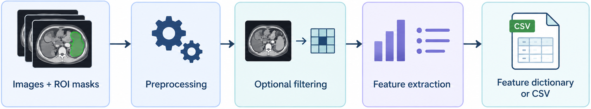
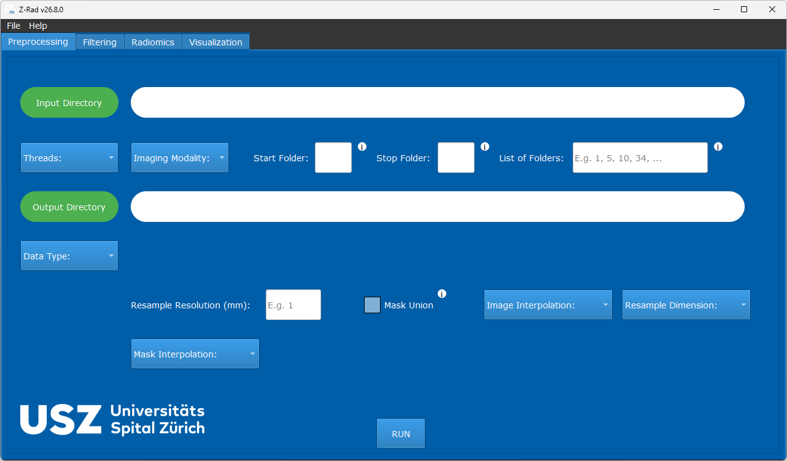

# Z-Rad

[](https://github.com/medical-physics-usz/z-rad/actions/workflows/test.yml)
[](https://github.com/medical-physics-usz/z-rad/actions/workflows/python-lint.yml)
[](https://github.com/medical-physics-usz/z-rad/actions/workflows/docs.yml)
[](https://pypi.org/project/z-rad/)
[](https://pypi.org/project/z-rad/)
[](https://github.com/medical-physics-usz/z-rad/blob/master/LICENSE)

<p align="center">
  
</p>

<p align="center">
  <strong>Extract quantitative features from medical images with a desktop interface or Python API.</strong><br />
  CT, PET, MR, MG, US, and RTDOSE · DICOM and NIfTI · Windows, macOS, and Linux<br />
  Developed by the Department of Radiation Oncology at University Hospital Zurich
</p>

<p align="center">
  <a href="#from-images-to-a-feature-table"><strong>Full IBSI I preprocessing and feature coverage · All IBSI II filters</strong></a>
</p>

<p align="center">
  <a href="https://github.com/medical-physics-usz/z-rad/releases">Download</a> ·
  <a href="https://medical-physics-usz.github.io/z-rad/">Documentation</a> ·
  <a href="#python-quickstart">Python quickstart</a> ·
  <a href="https://medical-physics-usz.github.io/z-rad/examples/">Examples</a> ·
  <a href="#ibsi-validation">Validation</a>
</p>

## From images to a feature table

<p align="center">
  
</p>
<p align="center">
  <em>Use preprocessing, filtering, and feature extraction independently or combine them into a complete workflow.</em>
</p>
<br>

| Capability | What you can do |
| --- | --- |
| Inspect images | View images and ROI masks together in the desktop viewer. |
| Prepare images | Convert DICOM to NIfTI and apply **all IBSI I preprocessing operations**, including image and mask interpolation, resegmentation, and intensity discretization. |
| Filter images | Apply **all IBSI II filters**, including mean, LoG, Laws, Gabor, separable wavelets, Simoncelli, and Riesz transforms. |
| Extract features | Calculate **all IBSI I radiomic features** across morphology, local intensity, intensity statistics, histograms, intensity-volume histograms, and texture, with applicable 2D, 2.5D, and 3D aggregation options. |
| Process cohorts | Run preprocessing, filtering, and feature extraction across case folders through the GUI or Python batch APIs. |
| Export results | Collect feature dictionaries in Python or export batch radiomics results to CSV. |

<br>
<p align="center">
  
</p>

<p align="center">
  <em>Run the workflow interactively through the
    <a href="https://medical-physics-usz.github.io/z-rad/user/gui_workflows.html">graphical user interface</a>
    or automate it with the
    <a href="https://medical-physics-usz.github.io/z-rad/user/api_quickstart.html">Python API</a>.</em>
</p>


## Supported images and masks

| Data format | Data type | Supported types and notes |
| --- | --- | --- |
| DICOM | Image | CT, MR, PET (PT), mammography (MG), ultrasound (US), and RTDOSE. |
| DICOM | Mask | RTSTRUCT contours and BINARY DICOM SEG objects; select ROIs by structure name or segment label. |
| NIfTI | Image | Scalar image volumes with spatial geometry. |
| NIfTI | Mask | One binary ROI mask per file, paired with its reference image. |

Use scalar image volumes with masks on the same physical voxel grid. See the [data-format and folder-layout guide](https://medical-physics-usz.github.io/z-rad/user/data_structure.html) for input restrictions, case organization, and structure selection.

## Get started

### Desktop application

1. Open [Z-Rad releases](https://github.com/medical-physics-usz/z-rad/releases) and choose a release.
2. Download the asset for your platform:

   | Platform | Release asset | Launch |
   | --- | --- | --- |
   | Windows | `z-rad-<release-tag>-windows.exe` | Run the executable. |
   | Apple Silicon macOS | `z-rad-<release-tag>-macos-arm64.zip` | Extract the archive and open `Z-Rad.app`. |

3. Follow the [GUI quickstart](https://medical-physics-usz.github.io/z-rad/user/gui_quickstart.html) to select your input data, configure processing, and run your first analysis.

The macOS app is currently unsigned and unnotarized, so Gatekeeper may show a warning. For Linux, Intel Macs, or the current source version, follow [Run from a repository checkout](https://medical-physics-usz.github.io/z-rad/user/installation.html#run-from-a-repository-checkout) to install and launch the GUI.

### Python quickstart

**Requires Python 3.11 or newer.** Install the published package:

```sh
python -m pip install z-rad
```

The example below requires your own NIfTI image and binary ROI mask on the same physical voxel grid. Replace the two paths with your files. It extracts intensity statistics without resampling or filtering:

```python
from zrad.image import Image
from zrad.preprocessing import IntensityMaskBuilder, RoiData
from zrad.radiomics import Radiomics

image = Image.from_nifti("path/to/image.nii.gz")
mask = Image.from_nifti_mask("path/to/mask.nii.gz", reference=image)
roi = IntensityMaskBuilder().apply(RoiData(image=image, morphological_mask=mask))
features = Radiomics().extract_features(roi_data=roi, families=["intensity_statistics"])
print(features["stat_mean"])
```

The result is a dictionary of feature names and values. To try a complete example with supplied data and an expected result, follow the [bundled phantom example](https://medical-physics-usz.github.io/z-rad/user/api_quickstart.html#run-the-bundled-phantom-example). Texture and intensity-volume histogram features require additional preparation; see the [full Python workflow](https://medical-physics-usz.github.io/z-rad/user/api_quickstart.html#recommended-workflow) and follow the documentation for your installed release.

## IBSI validation

Automated benchmarks compare Z-Rad results against published reference data from the Image Biomarker Standardisation Initiative (IBSI):

- **IBSI I:** digital-phantom features and CT configurations A–E, including preprocessing diagnostics.
- **IBSI II:** digital-phantom filter response maps and features from filtered CT images.
- **IBSI-SUV:** SUV conversion checks using valid and intentionally invalid digital reference objects.

Implementation coverage describes available operations; benchmark agreement applies to the tested configurations and features. See [IBSI coverage and limitations](https://medical-physics-usz.github.io/z-rad/ibsi/) for the scope, comparison rules, and unavailable references, and [execution reports and reproduction](https://medical-physics-usz.github.io/z-rad/developer/testing.html#ibsi-benchmark-reports) to inspect results for a particular revision.

## Contribute and get in touch

Found a bug or have a feature request? [Open an issue](https://github.com/medical-physics-usz/z-rad/issues). To contribute code or documentation, start with the [contributing guide](https://medical-physics-usz.github.io/z-rad/developer/contributing.html).

For questions or research collaborations, contact [zrad@usz.ch](mailto:zrad@usz.ch).
