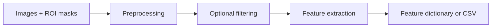

<p>
  <a href="https://pypi.org/project/z-rad/"></a>
  <a href="https://pypi.org/project/z-rad/"></a>
  <a href="https://github.com/medical-physics-usz/z-rad/actions/workflows/test.yml"></a>
  <a href="LICENSE"></a>
</p>

<p align="center">
  
</p>

<p align="center">
  <strong>Extract quantitative features from medical images with a desktop interface or Python API.</strong><br />
  CT, PET, MR, MG, US, and RTDOSE · DICOM and NIfTI · Windows, macOS, and Linux<br />
  Developed by the Department of Radiation Oncology at University Hospital Zurich
</p>

<p align="center">
  <a href="https://github.com/medical-physics-usz/z-rad/releases">Download</a> ·
  <a href="https://medical-physics-usz.github.io/z-rad/">Documentation</a> ·
  <a href="#python-quickstart">Python quickstart</a> ·
  <a href="https://medical-physics-usz.github.io/z-rad/examples/">Examples</a> ·
  <a href="#ibsi-validation-and-reproducibility">Validation</a>
</p>

## From images to a feature table



Use the same processing stages interactively through the desktop application or automate them with Python. See the [workflow guide](https://medical-physics-usz.github.io/z-rad/user/gui_workflows.html) for data preparation and processing choices.

## See what you can do

| Capability | What you can do |
| --- | --- |
| Inspect images | View images and ROI masks together in the [desktop viewer](https://medical-physics-usz.github.io/z-rad/user/visualization.html). |
| Prepare images | Convert DICOM to NIfTI, resample images and masks, resegment intensities, and configure discretization. |
| Filter images | Apply standardized spatial and wavelet filters before feature extraction. |
| Extract features | Calculate shape, intensity, and texture features with 2D, 2.5D, and 3D aggregation options. |
| Process cohorts | Use the GUI or Python batch APIs to preprocess, filter, and extract features across case folders. |
| Use the results | Collect feature dictionaries in Python or export batch radiomics results to a CSV file. |

<p align="center">
  
</p>

*IBSI II CT phantom: (A) unfiltered, (B) mean, (C) Laplacian-of-Gaussian, and (D) Daubechies 3 wavelet filtering. See [filter settings and the worked example](https://medical-physics-usz.github.io/z-rad/examples/gui_filtering.html).*

## Supported images and masks

| Data format | Data type | Supported types and notes |
| --- | --- | --- |
| DICOM | Image | CT, MR, PET (PT), mammography (MG), ultrasound (US), and RTDOSE. |
| DICOM | Mask | RTSTRUCT contours and BINARY DICOM SEG objects; select ROIs by structure name or segment label. |
| NIfTI | Image | Scalar image volumes with spatial geometry. |
| NIfTI | Mask | One binary ROI mask per file, paired with its reference image. |

Use scalar image volumes with masks on the same physical voxel grid. DICOM SEG support excludes fractional and label-map segmentations. Ultrasound input must be a single DICOM file with `PixelSpacing` and `SliceThickness` metadata.

See the [data-format and folder-layout guide](https://medical-physics-usz.github.io/z-rad/user/data_structure.html) for organizing cases, naming masks, and selecting DICOM structures, and the [Python image reference](https://medical-physics-usz.github.io/z-rad/reference/image.html) for in-memory inputs.

## Full IBSI implementation coverage

Z-Rad supports **all IBSI I preprocessing operations and radiomic features, and all IBSI II filters** defined by the Image Biomarker Standardisation Initiative (IBSI).

| Standard | Implementation coverage | Explore |
| --- | --- | --- |
| IBSI I · Preprocessing | All operations, including image and mask interpolation, resegmentation, and intensity discretization | [Preprocessing guide](https://medical-physics-usz.github.io/z-rad/user/preprocessing.html) |
| IBSI I · Features | All feature families, including morphology, local intensity, intensity statistics, histograms, intensity-volume histograms, and texture | [Feature guide](https://medical-physics-usz.github.io/z-rad/user/radiomics.html) |
| IBSI II · Filters | All filters, including mean, LoG, Laws, Gabor, separable wavelets, Simoncelli, and Riesz transforms | [Filtering guide](https://medical-physics-usz.github.io/z-rad/user/filtering.html) |


## Get started

### Desktop application

1. Open [Z-Rad releases](https://github.com/medical-physics-usz/z-rad/releases) and choose a release.
2. Download the asset for your platform:

   | Platform | Release asset | Launch |
   | --- | --- | --- |
   | Windows | `z-rad-<release-tag>-windows.exe` | Run the executable. |
   | Apple Silicon macOS | `z-rad-<release-tag>-macos-arm64.zip` | Extract the archive and open `Z-Rad.app`. |

3. Follow the [GUI quickstart](https://medical-physics-usz.github.io/z-rad/user/gui_quickstart.html) to select your input data, configure processing, and run your first analysis.

The macOS app is currently unsigned and unnotarized, so Gatekeeper may show a warning. For Linux and Intel Macs, or to run the current source version, use the Python setup below and launch `python main.py`. See the [installation guide](https://medical-physics-usz.github.io/z-rad/user/installation.html) for details.

### Python quickstart

**Requires Python 3.11 or newer.** Install the published package:

```sh
python -m pip install z-rad
```

Follow the documentation for your installed release. The [full Python workflow](https://medical-physics-usz.github.io/z-rad/user/api_quickstart.html) covers resampling, filtering, texture discretization, and batch extraction.

<details>
<summary>Run an example with bundled data</summary>

To try the example below with the current source and bundled IBSI phantom, clone the repository and install it in a virtual environment:

```sh
git clone https://github.com/medical-physics-usz/z-rad.git
cd z-rad
python -m venv .venv
```

Activate the environment with `source .venv/bin/activate` on macOS/Linux or `.venv\Scripts\Activate.ps1` in Windows PowerShell, then install:

```sh
python -m pip install -e .
```

Run this example from the repository root. It loads the bundled CT phantom and ROI mask, then extracts intensity statistics without resampling or filtering:

```python
from pathlib import Path
from tempfile import TemporaryDirectory
from zipfile import ZipFile

from zrad.image import Image
from zrad.preprocessing import IntensityMaskBuilder, RoiData
from zrad.radiomics import Radiomics

with TemporaryDirectory() as folder:
    with ZipFile("tests/data/IBSI_I.zip") as archive:
        for name in ("image/phantom.nii.gz", "mask/mask.nii.gz"):
            archive.extract(f"IBSI_I/nifti/{name}", folder)

    data = Path(folder) / "IBSI_I/nifti"
    image = Image.from_nifti(data / "image/phantom.nii.gz")
    mask = Image.from_nifti_mask(data / "mask/mask.nii.gz", reference=image)
    roi = IntensityMaskBuilder().apply(RoiData(image=image, morphological_mask=mask))
    features = Radiomics().extract_features(roi_data=roi, families=["intensity_statistics"])

    print(f"Mean intensity: {features['stat_mean']:.2f} HU")
```

Expected output:

```text
Mean intensity: -46.88 HU
```

The result is a dictionary of feature names and values; this example prints the ROI's mean CT intensity.

</details>

## IBSI validation and reproducibility

Z-Rad includes automated comparisons against IBSI reference material. The implementation follows [IBSI I](https://arxiv.org/abs/1612.07003) and [IBSI II](https://arxiv.org/abs/2006.05470); the benchmark suites make numerical agreement inspectable:

- **IBSI I:** digital and CT phantom tests cover preprocessing configurations and feature comparisons using the reference tables' per-feature tolerances. [Inspect the tests](tests/test_ibsi_1.py).
- **IBSI II:** digital phantom tests compare filter response maps, and CT phantom tests compare features from filtered images. Response-map comparisons use a tolerance of 1% of the reference map's intensity range; feature comparisons use the reference tables' tolerances. [Inspect the tests](tests/test_ibsi_2.py).

## Contribute and get in touch

Found a bug or have a feature request? [Open an issue](https://github.com/medical-physics-usz/z-rad/issues). To contribute code or documentation, start with the [contributing guide](https://medical-physics-usz.github.io/z-rad/developer/contributing.html).

For questions or research collaborations, contact [zrad@usz.ch](mailto:zrad@usz.ch). Z-Rad is developed at University Hospital Zurich and released under the [MIT License](LICENSE).
