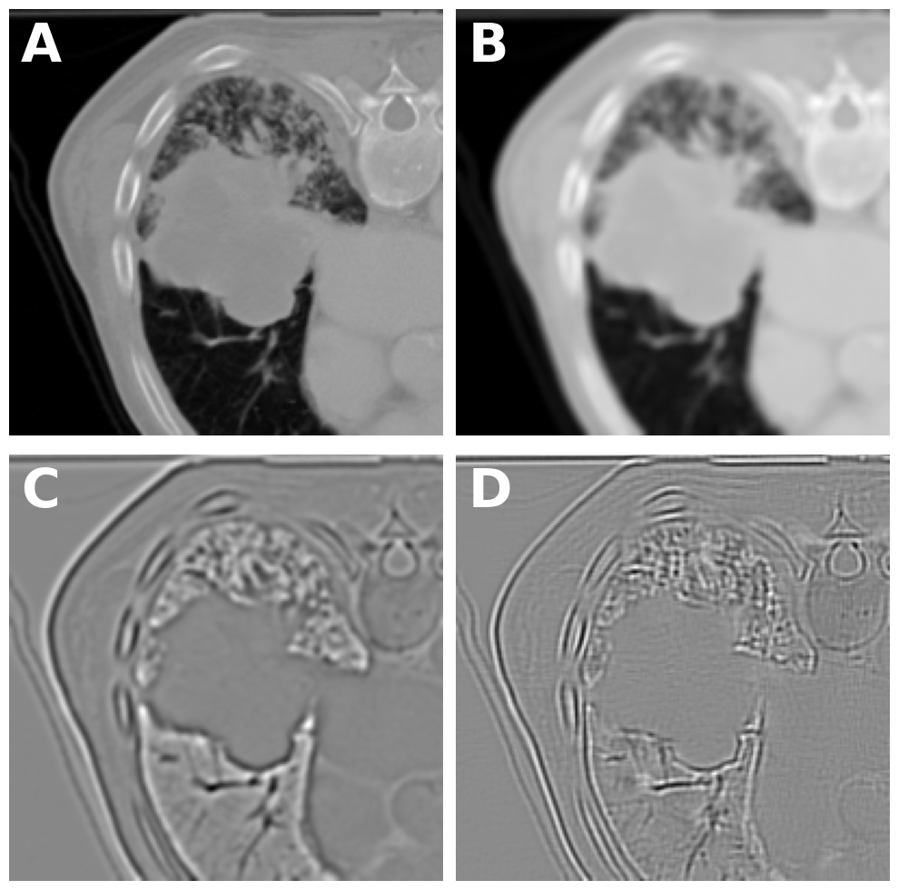
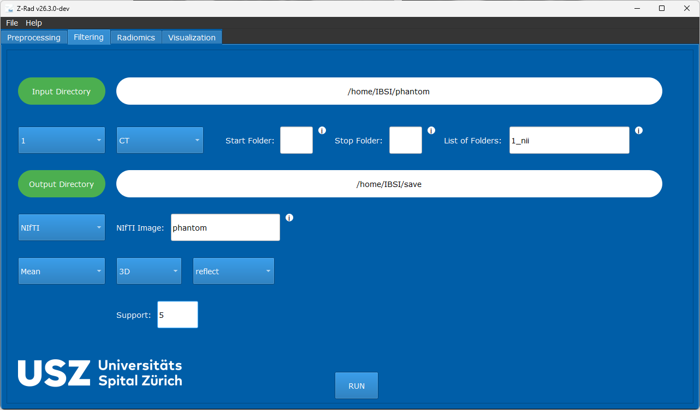
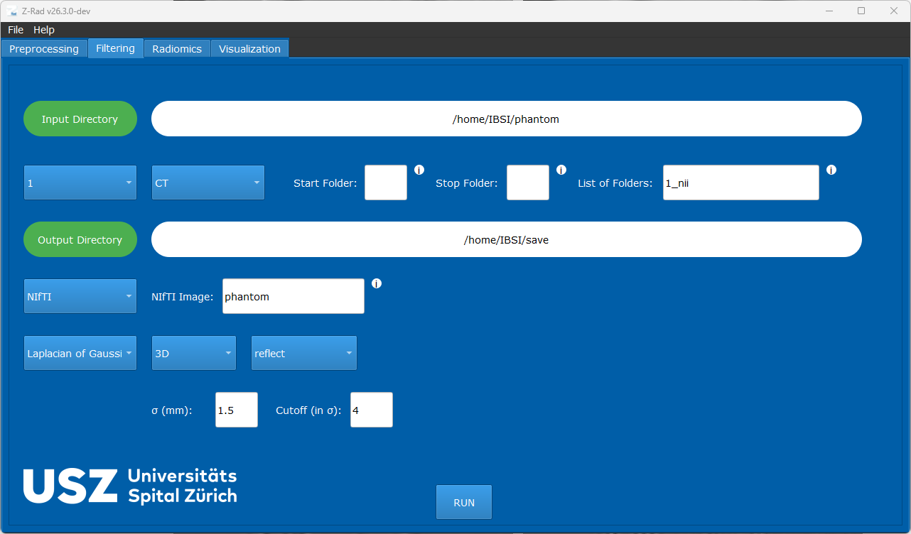
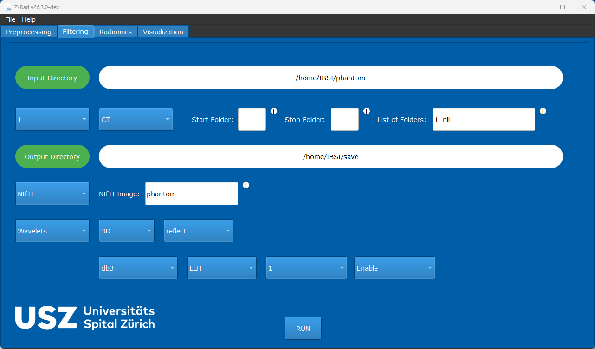

Filtering in GUI
================

This example compares several GUI filtering configurations based on the IBSI II
phantom and shows how the corresponding filter setup looks in Z-Rad.

Filtering Results
-----------------

   Filtering results on the IBSI II phantom: unfiltered, 3D mean, 3D LoG, and
   3D wavelet responses.

The archive example compares:

* no filtering
* a ``3D`` mean filter with reflect padding and support ``5``
* a ``3D`` LoG filter with reflect padding, ``1.5`` mm scale, and ``4 sigma`` cutoff
* a ``3D`` Daubechies 3 wavelet filter with first-level ``LLH`` response and
  pseudo-rotational invariance

Mean Filter Example
-------------------

   Example configuration for a ``3D`` mean filter.

LoG Filter Example
------------------

   Example configuration for a ``3D`` Laplacian-of-Gaussian filter.

Wavelet Filter Example
----------------------

   Example configuration for a ``3D`` Daubechies 3 wavelet filter.

See also :doc:`../user/filtering` for the full filtering guide.
