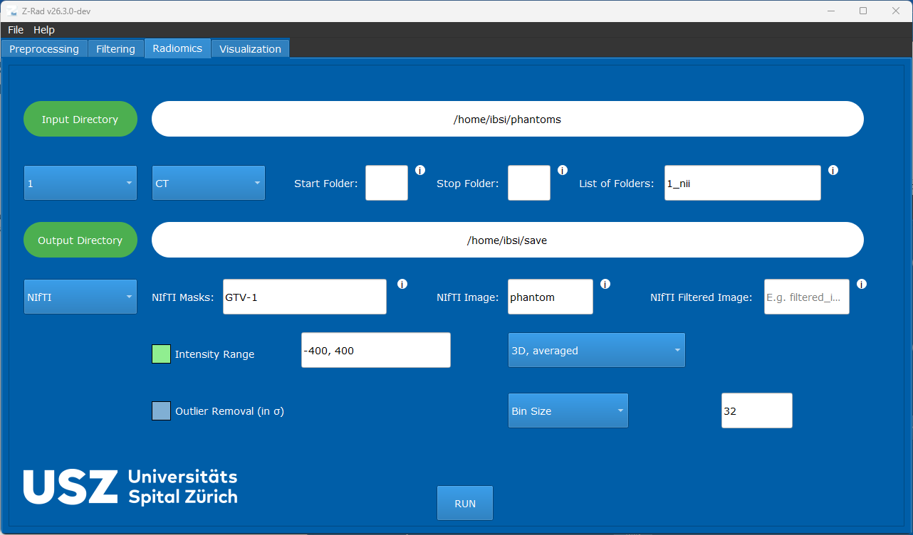

Radiomics extraction in GUI
===========================

This example shows a representative radiomics extraction setup for the GUI
workflow.

Example Configuration
---------------------

   Example radiomics configuration in the GUI.

The archived configuration extracts radiomics from ``phantom.nii.gz`` inside
the mask ``GTV-1.nii.gz`` with:

* no filtered image
* no outlier removal
* intensity range ``-400`` to ``400``
* ``3D`` averaged texture aggregation
* bin size ``32``

See also :doc:`../user/radiomics` for the full radiomics guide.
