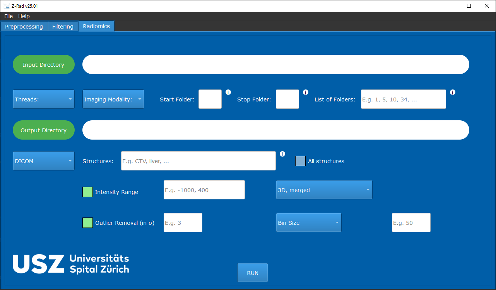

Z-Rad Documentation
===================

Z-Rad is a radiomics toolkit with both a graphical interface and a Python API.
The documentation below is organized around the main user workflows: installing
the application, running preprocessing and filtering, extracting radiomics
features, and validating results against IBSI reference data.

Highlights
----------

* GUI and Python API for the same radiomics workflows.
* Support for CT, MR, and PT imaging modalities.
* DICOM and NIfTI-based workflows.
* IBSI-oriented preprocessing, filtering, and feature extraction.

.. toctree::
   :maxdepth: 2
   :caption: User Guide

   installation
   quickstart_gui
   quickstart_api
   preprocessing
   filtering
   radiomics
   ibsi_validation
   troubleshooting
   api_reference
