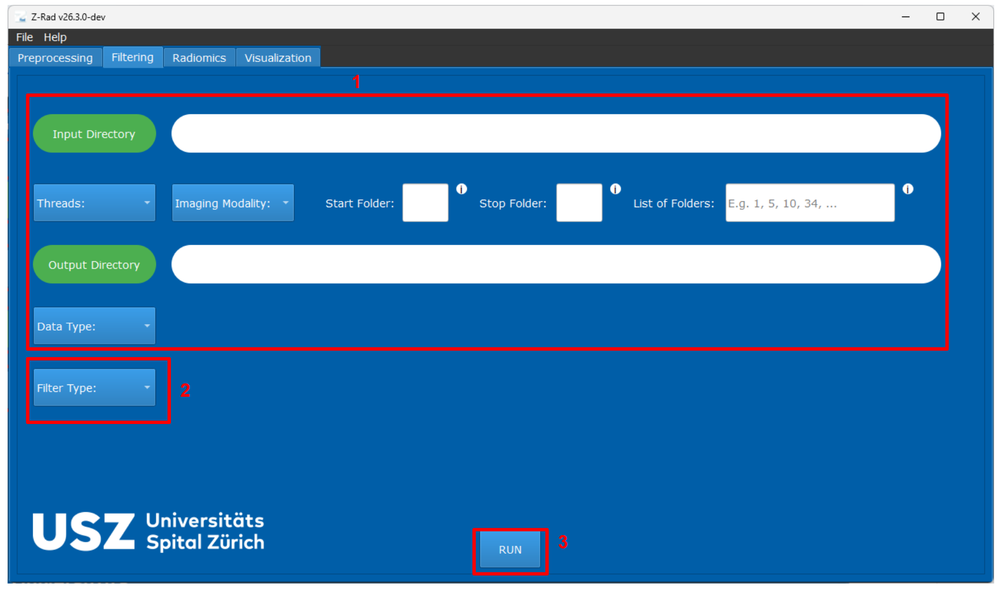

GUI Filtering
=============

Overview
--------

The filtering layer applies optional image transforms before radiomics feature
extraction. In Python code, instantiate concrete filter classes directly. The
``create_filter(...)`` helper is kept for GUI and configuration-driven
workflows where the filter family is selected by name.

Python API
----------

Concrete filters expose a small, consistent API:

* configure the filter in the constructor
* call ``apply(image)`` to return a filtered ``Image``
* call ``apply(roi_data)`` inside a preprocessing ``Pipeline`` to set
  ``roi_data.filtered_image``

.. code-block:: python

   from zrad.filtering import Mean

   image_filter = Mean(
       padding_type="reflect",
       support=3,
       dimensionality="3D",
   )

   filtered_image = image_filter.apply(image)

For dynamic workflows, use ``create_filter(...)`` when the filter type and
parameters come from a GUI form or saved configuration:

.. code-block:: python

   from zrad.filtering import create_filter

   image_filter = create_filter(
       filtering_method="Mean",
       padding_type="reflect",
       support=3,
       dimensionality="3D",
   )

   Filtering tab in the GUI.

Main Controls
-------------

The filtering workflow is organized around the following GUI sections. The
numbering below matches the annotated screenshots used for this workflow.

``(1)`` Upper workflow section
   The upper part of the filtering tab mirrors the preprocessing tab. You use
   it to select the input directory, output directory, thread count, imaging
   modality, and the folders that should be processed. Unlike preprocessing, no
   mask selection is required because filtering is applied to images only.

``(2)`` ``Filter Type``
   Select the image transform to apply. The GUI currently supports:

   * Mean
   * Laplacian of Gaussian
   * Riesz-transformed LoG
   * Gabor
   * Laws kernels
   * Wavelets
   * Simoncelli

   Once a filter is selected, Z-Rad displays the corresponding
   filter-specific parameters.

``(3)`` ``RUN``
   Starts the filtering process. The filtered images are written to the
   selected output directory.

Filter Parameters
-----------------

After a filter is selected in ``(2)``, the parameter fields shown in the GUI
depend on the chosen filter family.

Most filters use some combination of:

* ``padding_type``: ``constant``, ``nearest``, ``wrap``, or ``reflect``
* ``dimensionality``: ``2D`` or ``3D``
* physical scale parameters such as ``sigma_mm`` or ``lambda_mm``

The available filter families are:

* Mean
* Laplacian of Gaussian
* Riesz-transformed LoG
* Gabor
* Laws kernels
* Wavelets, including Daubechies 2, Daubechies 3, first-order Coiflet, and
  Haar filters
* non-separable Simoncelli wavelets

Wavelet filtering additionally requires:

* ``wavelet_type``
* ``response_map``
* ``decomposition_level``
* optional rotation invariance

Riesz-transformed LoG additionally requires a non-negative ``riesz_order``
multi-index with two entries for 2D filtering or three entries for 3D
filtering. The entries follow physical ``(x, y)`` or ``(x, y, z)`` axis order,
and their sum must be positive. The optional ``structure_tensor_sigma_mm``
locally aligns a pure second-order 3D response, such as ``(2, 0, 0)``.

Simoncelli filtering requires a positive ``decomposition_level`` and supports
``nearest`` or periodic (``wrap``) padding. Its optional ``riesz_order`` has
the same dimensionality and axis-order rules as the Riesz-transformed LoG
index. If the index is omitted or contains only zeros, the filter returns the
isotropic Simoncelli band-pass response.

The concrete filters can be configured directly in Python:

.. code-block:: python

   from zrad.filtering import RieszLoG, Simoncelli

   riesz_log = RieszLoG(
       padding_type="reflect",
       sigma_mm=1.5,
       cutoff=4.0,
       dimensionality="3D",
       riesz_order=(2, 0, 0),
       structure_tensor_sigma_mm=1.0,
   )

   simoncelli = Simoncelli(
       padding_type="nearest",
       decomposition_level=2,
       dimensionality="3D",
       riesz_order=(1, 0, 0),
   )

The implementation follows IBSI II definitions, so physical scales, response
maps, decomposition levels, and rotation-invariance settings should be chosen
consistently with the downstream analysis protocol.

Practical Notes
---------------

* The upper section ``(1)`` uses the same dataset-selection logic as
  preprocessing, including support for numeric folder ranges and explicit
  folder lists.
* Filtering is optional. You can extract radiomics features directly from a
  resampled image if your analysis does not require a transformed image.
* The filter parameters shown after selecting ``(2)`` depend entirely on the
  chosen filter family.
* Laplacian-of-Gaussian filtering derives the working resolution from the input
  image spacing.
* Riesz-transformed LoG uses the same physical LoG scale and applies the Riesz
  transform to that response.
* The Simoncelli GUI offers decomposition levels 1 through 3. The Python API
  accepts any positive integer level, subject to the available image-frequency
  support.
* Input configurations can be saved from the GUI and loaded again for repeated
  experiments, which is useful when comparing several filter settings.
* If you are comparing multiple filter families, keep the preprocessing and
  radiomics settings fixed so that the impact of the filtering step remains
  interpretable.

For a task-oriented walkthrough, see :doc:`../examples/gui_filtering`.
