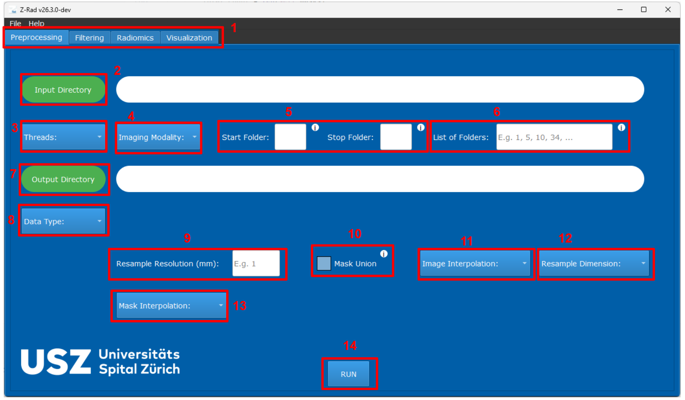
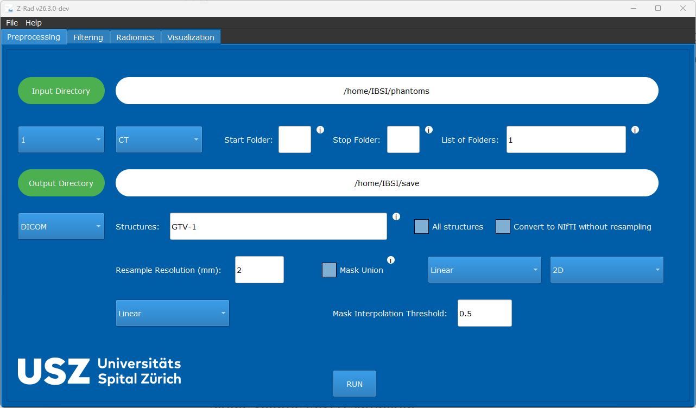
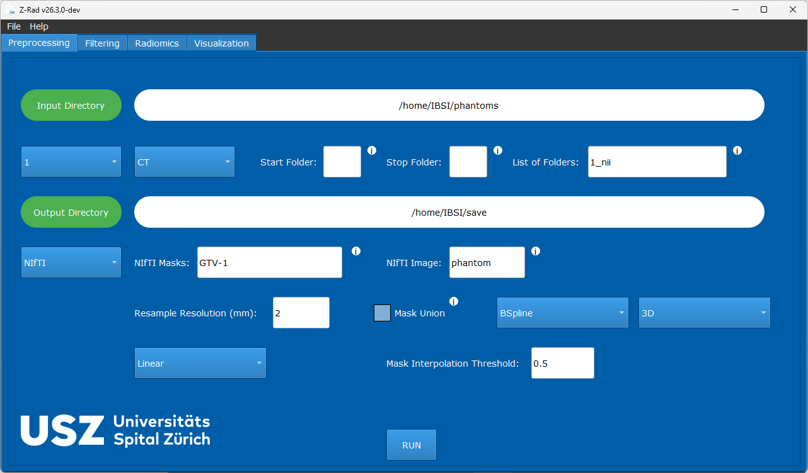

GUI Preprocessing
=============

Overview
--------

The preprocessing tab is used to import DICOM or NIfTI data, select the masks
to process, and resample images and segmentations onto a target voxel grid
before filtering or radiomics extraction.

   Preprocessing tab in the GUI.

GUI Workflow
------------

The main controls in the preprocessing tab map to the following tasks:

* The top area is used to select the input directory, output directory, imaging
  modality, and the number of worker processes.
* Folder selection can be driven either by numeric start and stop folders or by
  an explicit folder list. If neither is provided, Z-Rad processes every folder
  under the selected dataset directory.
* ``Data Type`` chooses between DICOM and NIfTI input.
* ``Resample Resolution`` and ``Resample Dimension`` define the target voxel
  spacing and whether resampling is slice-wise or volumetric.
* Separate interpolation settings are exposed for images and masks. For masks,
  non-nearest interpolation requires a threshold that converts resampled values
  back to a binary label map.
* ``Mask Union`` combines multiple selected masks into one mask during
  preprocessing.

DICOM And NIfTI Input
---------------------

.. figure:: ../images/prepr_dcm.png
   :alt: DICOM-specific preprocessing controls
   :width: 900

   Additional options shown when the input data type is DICOM.

For DICOM workflows, Z-Rad can:

* select specific RTSTRUCT structures
* process every non-empty structure found in the study
* export DICOM images and structures to NIfTI without additional modification

   Additional options shown when the input data type is NIfTI.

For NIfTI workflows, users provide the image filename and one or more mask
filenames to be matched in each case folder. Missing masks or structures are
skipped rather than terminating the run.

Behavior
--------

Z-Rad computes:

* the output spacing from the requested resolution and dimensionality
* a centered output origin that preserves spatial alignment
* the output voxel grid size from input shape and spacing

Image and mask resampling share the same spatial transform, then diverge in the
final output handling:

* images are cast according to imaging modality
* masks are thresholded back to a binary label map

Practical Notes
---------------

* ``2D`` resampling preserves the original slice spacing in the third axis.
* CT images are rounded and stored as signed 16-bit integers after resampling.
* MR and PT images remain floating-point volumes.
* Input configurations can be saved from the GUI and later restored for
  reproducible reruns.

Example
--------

   Example DICOM preprocessing setup.

This DICOM example corresponds to:

* structure ``GTV-1``
* slice-wise 2D resampling
* linear interpolation to ``2 x 2`` mm in-plane spacing
* linear ROI interpolation with a threshold of ``0.5``

   Example NIfTI preprocessing setup.

This NIfTI example corresponds to:

* image ``phantom.nii.gz``
* mask ``GTV-1.nii.gz``
* full 3D resampling
* B-spline image interpolation to ``2 x 2 x 2`` mm
* linear ROI interpolation with a threshold of ``0.5``