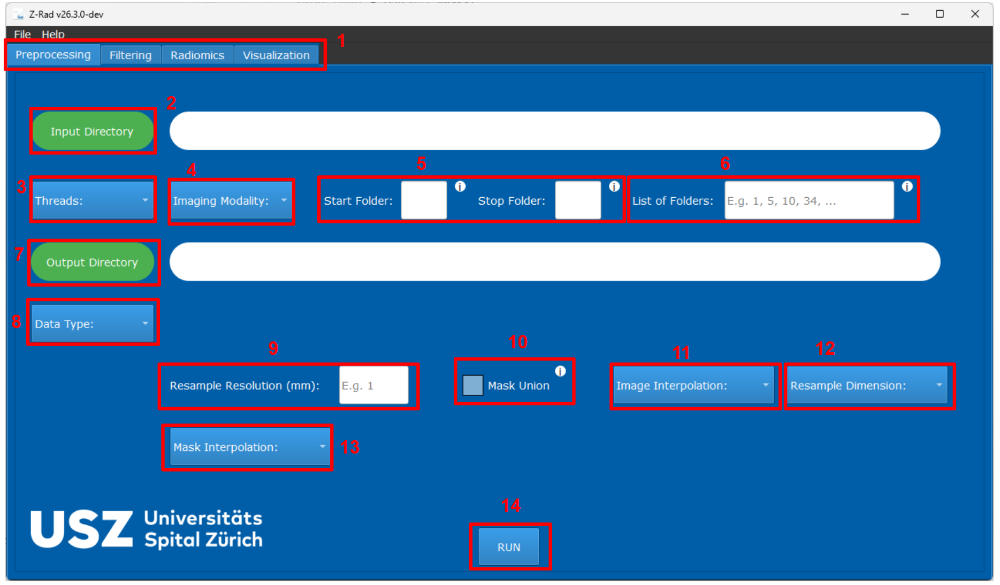
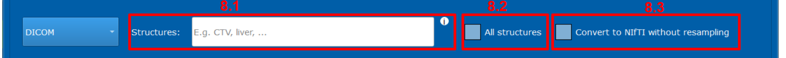

GUI preprocessing
=================

Use the Preprocessing tab to convert DICOM data to NIfTI or resample images
and masks to a target voxel spacing. The output can then be used for filtering
or feature extraction.

   Preprocessing tab in the GUI.

Main controls
-------------

The numbers below match the annotated screenshot.

``(1)`` ``Preprocessing tab``
   Use the top tab bar to navigate between the main parts of the application.
   This page describes the controls shown when ``Preprocessing`` is active.

``(2)`` ``Input Directory``
   Select the dataset directory that contains one subfolder per case. For the
   expected folder layout, see :doc:`data_structure`.

``(3)`` ``Threads``
   Choose how many case folders to process in parallel. More threads can
   reduce runtime but use more memory.

``(4)`` ``Imaging Modality``
   Select the modality of the input image series or image file set. All cases
   processed in one run should belong to the same modality.

``(5)`` ``Start Folder`` and ``Stop Folder``
   Limit processing to a numeric folder range. This only works when the case
   folders have integer names.

``(6)`` ``List of Folders``
   Process an explicit comma-separated set of folders such as ``1, 5, 10`` or
   mixed names such as ``patient_A, patient_B``. If neither ``(5)`` nor
   ``(6)`` is set, Z-Rad processes every subfolder in the selected input
   directory.

``(7)`` ``Output Directory``
   Choose where to save processed images and masks. Z-Rad creates the
   directory if needed.

``(8)`` ``Data Type``
   Choose whether the input dataset is DICOM or NIfTI. This selection controls
   which additional preprocessing fields become visible.

``(9)`` ``Resample Resolution``
   Sets the target voxel spacing in millimetres.

``(10)`` ``Mask Union``
   Combines all selected masks into a single union mask in addition to the
   individually saved masks.

``(11)`` ``Image Interpolation``
   Select the interpolation method used for the image volume. The GUI exposes
   nearest-neighbour, linear, B-spline, and Gaussian interpolation.

``(12)`` ``Resample Dimension``
   Controls whether resampling is performed slice-wise in ``2D`` or
   volumetrically in ``3D``.

``(13)`` ``Mask Interpolation``
   Select the interpolation method used for masks. When a method other than
   nearest-neighbour is selected, Z-Rad shows an additional threshold field that
   converts interpolated values back into a binary mask.

``(14)`` ``RUN``
   Starts preprocessing with the currently selected parameters.

DICOM input
-----------

   Additional options shown when the input data type is DICOM.

For DICOM workflows, the ``Data Type`` selection ``(8)`` exposes the following
controls:

``(8.1)`` ``Structures``
   Enter the ROI names from RTSTRUCT files or ``SegmentLabel`` values from
   DICOM SEG files to process.

``(8.2)`` ``All structures``
   Process every non-empty structure available in the RTSTRUCT or SEG file.

``(8.3)`` ``Convert to NIfTI without resampling``
   Export the DICOM image and selected structures as NIfTI files without
   changing voxel spacing.

NIfTI input
-----------

   Additional options shown when the input data type is NIfTI.

For NIfTI workflows, the ``Data Type`` selection ``(8)`` exposes:

``(8.4)`` ``NIfTI Masks``
   Enter one or more mask filenames without file extensions.

``(8.5)`` ``NIfTI Image``
   Enter the image filename without file extension.

Missing masks or structures are skipped rather than terminating the run.

Outputs
-------

Z-Rad creates one subfolder per case in the output directory. Each contains
``image.nii.gz`` and the processed masks named after their structures, such as
``GTV-1.nii.gz``. Use this directory as input for the next processing tab, with
``image`` as the NIfTI image name. See :doc:`gui_quickstart` for the complete
workflow.

Resampling and saved settings
-----------------------------

See :doc:`resampling_guidelines` for help choosing the target spacing,
dimension, image and mask interpolation, and mask threshold.

* ``2D`` resampling preserves the original slice spacing in the third axis.
* CT images are rounded and stored as signed 16-bit integers after resampling.
* MR and PET images remain floating-point volumes.
* Input configurations can be saved from the GUI and later reloaded for
  reproducible reruns (``File -> Save/Load Input`` or ``Ctrl+S``/``Ctrl+O``).

For configuration examples, see :doc:`../examples/gui_preprocessing`.
