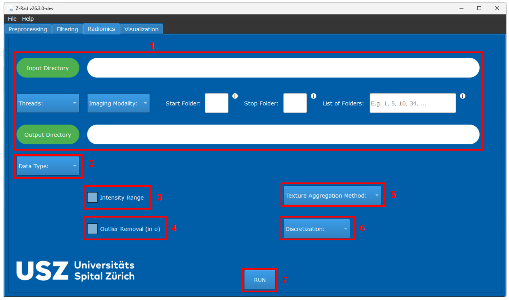

GUI Radiomics Extraction
========================

Overview
--------

The ``Radiomics`` class computes morphological, intensity, histogram, and
texture features from an image-mask pair. The extracted feature set depends on
the aggregation dimensionality and discretization choices.

   Radiomics extraction tab in the GUI.

Main Controls
-------------

The radiomics workflow is organized around the following GUI sections. The
numbering below matches the annotated screenshots used for this workflow.

``(1)`` Upper workflow section
   The upper part of the radiomics tab follows the same layout as the
   preprocessing and filtering tabs. You use it to select the input directory,
   output directory, thread count, imaging modality, and the folders that
   should be processed.

``(2)`` ``Data Type``
   Select whether the input dataset is DICOM or NIfTI. As in preprocessing,
   this choice determines which data-type-specific fields become visible for
   image and mask selection.

``(3)`` ``Intensity Range``
   Restricts the analyzed voxel intensities to a user-defined interval. This is
   useful when radiomic features should only be computed within a selected
   signal range.

``(4)`` ``Outlier Removal``
   Removes extreme voxel values based on a selected number of standard
   deviations. This can suppress unusually high or low intensities, but it can
   also create holes in the effective region of interest.

``(5)`` ``Texture Aggregation Method``
   Defines how texture matrices are computed and merged. The GUI supports
   ``2D``, ``2.5D``, and ``3D`` strategies, with merging or averaging rules
   depending on the selected option.

``(6)`` ``Discretization``
   Controls how image intensities are discretized before texture feature
   computation. The GUI supports fixed bin size and fixed bin number
   discretization.

``(7)`` ``RUN``
   Starts radiomics extraction with the currently selected configuration.

Feature Families
----------------

The implementation includes features from these groups:

* morphology
* local intensity
* intensity statistics
* intensity histogram
* GLCM
* GLRLM
* GLSZM
* GLDZM
* NGTDM
* NGLDM
* optional intensity-volume histogram features

In the GUI, the standard workflow exposes morphological, local intensity,
first-order, histogram, GLCM, GLRLM, GLSZM, and GLDZM features.

**Note:** Intensity-volume histogram features and the computationally
expensive Moran's I and Geary's C measures remain API-only.

Validation Constraints
----------------------

Z-Rad validates masks before extraction:

* For ``3D`` extraction, the mask must contain at least ``27`` valid voxels,
  and the bounding box of the nonzero mask region must be at least ``3``
  voxels wide in every dimension.
* For ``2D`` and ``2.5D`` extraction, Z-Rad validates each slice
  independently. A slice is discarded if it contains fewer than ``9`` valid
  voxels or if its nonzero bounding box is smaller than ``3`` voxels in either
  in-plane dimension.
* If no slice satisfies these ``2D`` or ``2.5D`` requirements, radiomics
  extraction is aborted for that mask.

These checks are important because many texture matrices are undefined or
unstable for extremely small masks.

Outputs
-------

After running ``(7)``, Z-Rad writes radiomics tables as ``.csv`` files to the
selected output directory. Each row begins with case and mask metadata, then
continues with the extracted radiomic features.

The output includes metadata such as:

* patient or case identifier
* mask identifier
* bounding-box metadata
* voxel count
* number of bins used for discretization

At the API level, the extracted values are also exposed through the
``features_`` dictionary.

Practical Notes
---------------

* The upper workflow section ``(1)`` uses the same dataset-selection logic as
  preprocessing and filtering.
* The choice of extraction parameters should be kept consistent across all analyzed cases.
* Intensity-volume histogram features and computationally expensive measures
  such as Moran's I and Geary's C are not exposed in the GUI and remain
  available through the API only.
* If you extract features from a filtered NIfTI image, the GUI expects both the
  original NIfTI image and the filtered NIfTI image to be provided.

For a task-oriented walkthrough, see :doc:`../examples/gui_radiomics`.
