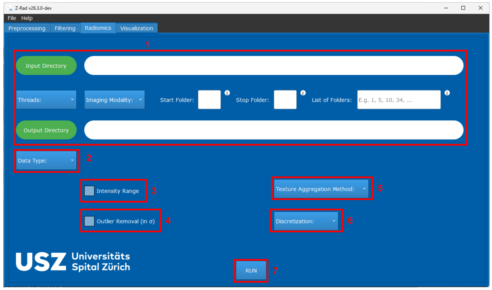

GUI radiomics extraction
========================

Use the Radiomics tab to extract features from images and region-of-interest
(ROI) masks and save the results to a CSV file. Start with the images and masks
prepared for your analysis; see :doc:`gui_quickstart` for a complete workflow.

   Radiomics extraction tab in the GUI.

Main controls
-------------

The numbers below match the annotated screenshot.

``(1)`` Upper workflow section
   The upper part of the radiomics tab follows the same layout as the
   preprocessing and filtering tabs. You use it to select the input directory,
   output directory, thread count, imaging modality, and the folders that
   should be processed.

``(2)`` ``Data Type``
   Select whether the input dataset is DICOM or NIfTI. As in preprocessing,
   this choice determines which data-type-specific fields become visible for
   image and mask selection.

``(3)`` ``Intensity Range``
   Keep only voxels within the selected intensity interval for intensity
   and texture analysis. This restriction is applied before discretization
   and leaves the mask used for morphology unchanged. For fixed bin size
   discretization, the lower bound becomes the bin origin. See
   :doc:`resegmentation_guidelines`.

``(4)`` ``Outlier Removal``
   Removes extreme voxel values based on a selected number of standard
   deviations calculated from the current valid intensity mask. If an intensity
   range is also configured, range re-segmentation is applied first. This can
   suppress unusually high or low intensities, but it can also create holes in
   the effective region of interest.

``(5)`` ``Texture Aggregation Method``
   Defines how texture matrices are computed and merged. The GUI supports
   ``2D``, ``2.5D``, and ``3D`` strategies, with merging or averaging rules
   depending on the selected option. See :doc:`extraction_concepts` for the
   available combinations and their Python equivalents.

``(6)`` ``Discretization``
   Controls how image intensities are discretized before texture feature
   computation. Choose ``Bin Size`` for a fixed intensity width or
   ``Number of Bins`` to divide each ROI's intensity range into a fixed number
   of bins. Fixed bin size requires an intensity range to define the bin
   origin. See :doc:`discretization_guidelines`.

``(7)`` ``RUN``
   Starts radiomics extraction with the currently selected configuration.

.. _choose-texture-aggregation:
.. _feature-families:
.. _validation-constraints:

For aggregation choices, supported feature families, and ROI size requirements,
see :doc:`extraction_concepts`.

Outputs
-------

After clicking ``RUN``, open ``radiomics.csv`` in the selected output
directory. Each row begins with case and mask metadata, then
continues with the extracted radiomic features.

See :doc:`results` for column definitions, feature-name suffixes, and checks
for missing cases or masks.

Extraction from filtered images
-------------------------------

For NIfTI input, provide both the original image in ``NIfTI Image`` and the
filtered image in ``NIfTI Filtered Image``, together with the masks. All files
must be in the corresponding case folder, and names are entered without file
extensions. See :doc:`gui_quickstart` for the folder layout.

For a configuration example, see :doc:`../examples/gui_radiomics`. For missing
results or rejected settings, see :doc:`troubleshooting`.
