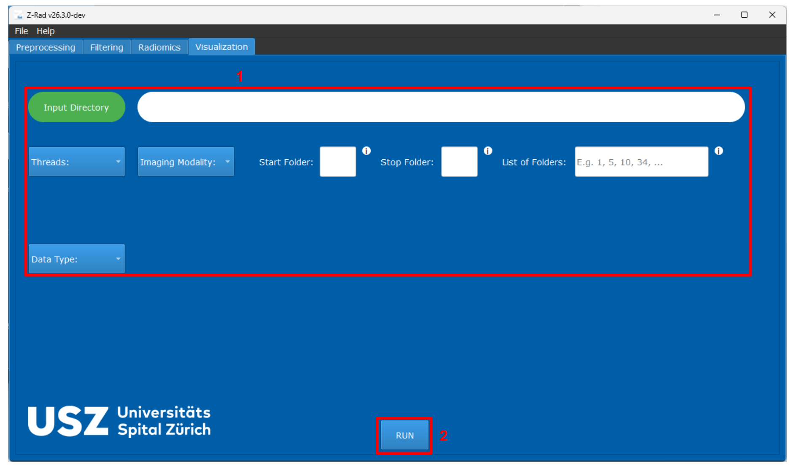
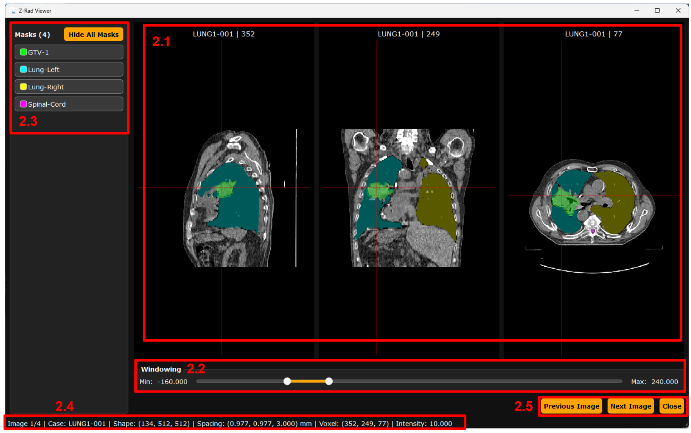

GUI visualization
=================

Use the Visualization tab to inspect images and mask overlays before
processing or to check the results of preprocessing and filtering.

   Visualization tab in the GUI.

Main controls
-------------

The numbers below match the annotated screenshot.

``(1)`` Upper workflow section
   The upper part of the visualization tab follows the same dataset-selection
   pattern as preprocessing, except that no output directory is required. Use
   this section to select the input directory, imaging modality, thread count,
   and the folders that should be opened.

``(2)`` ``RUN``
   Loads the selected images and opens the dedicated visualization window.

Viewer window
-------------

   Visualization window for image and mask inspection.

Use the viewer controls to inspect each case:

``(2.1)`` Projection panes
   The upper part of the viewer displays three orthogonal projections. These
   views can be scrolled and zoomed, and double-clicking one of them expands it
   to full-screen for closer inspection.

``(2.2)`` Windowing controls
   Adjust the displayed intensity range to see the tissue or image response
   of interest.

``(2.3)`` Mask visibility controls
   Masks can be hidden individually or all at once with the
   ``Hide All Masks`` control.

``(2.4)`` Image information panel
   Check the folder name, image shape, voxel spacing, cursor position,
   and intensity at the current voxel.

``(2.5)`` Navigation controls
   Use these controls to move through the loaded images and slices.

Check alignment before extraction
---------------------------------

Scroll through the ROI in all three views and confirm that the mask covers the
intended region. Check the image spacing and dimensions in the information
panel if the overlay looks displaced or distorted. See :doc:`troubleshooting`
for alignment checks.
